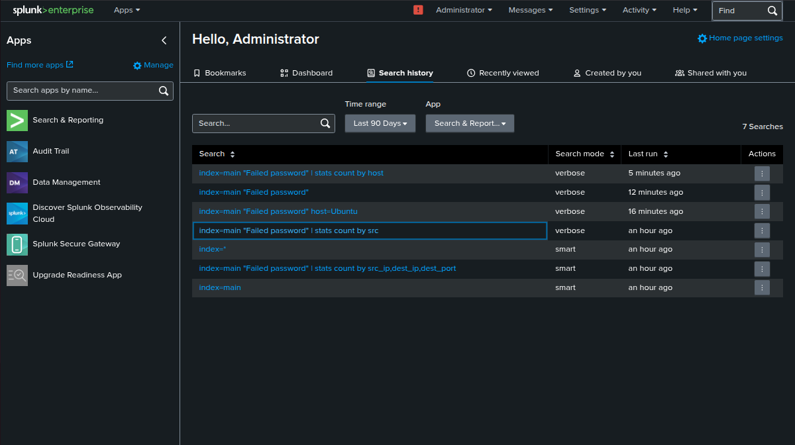
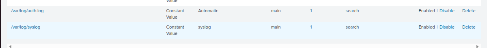
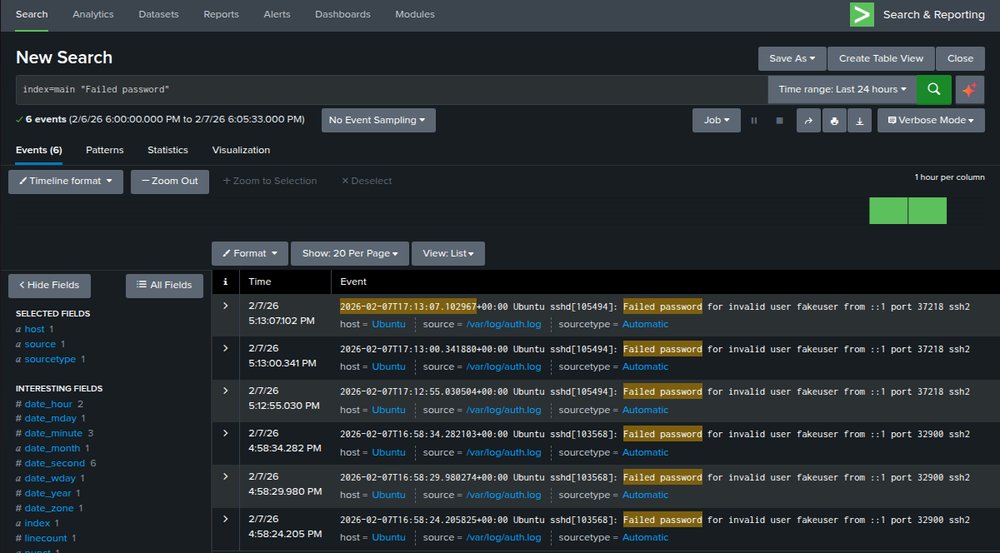
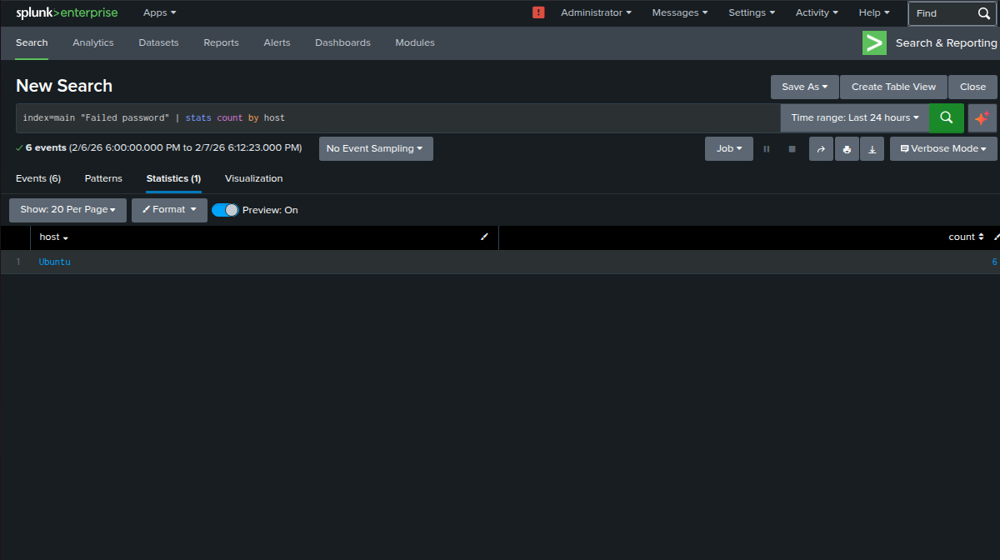

# Centralized Log Collection & Monitoring

## Objective
To collect and analyze Linux authentication logs using Splunk SIEM in order to detect suspicious login activity.

## Environment
- Ubuntu Linux (Log Source)
- Splunk SIEM
- VirtualBox

## Log Sources
- /var/log/auth.log
- /var/log/syslog

## Steps Performed
1. Installed and configured Splunk SIEM on Ubuntu
2. Added Linux authentication and system logs as data inputs
3. Generated failed SSH login attempts
4. Analyzed raw log events using Splunk Search
5. Aggregated failed login attempts to identify suspicious patterns

## Detection Use Case
- SSH failed login attempts (potential brute-force activity)

## Outcome
Successfully detected and analyzed failed SSH login attempts using Splunk SIEM.

## Screenshots
Splunk Dashboard:-

Log Inputs:-

Failed Login Events:-

Aggregated Failed Login:-

